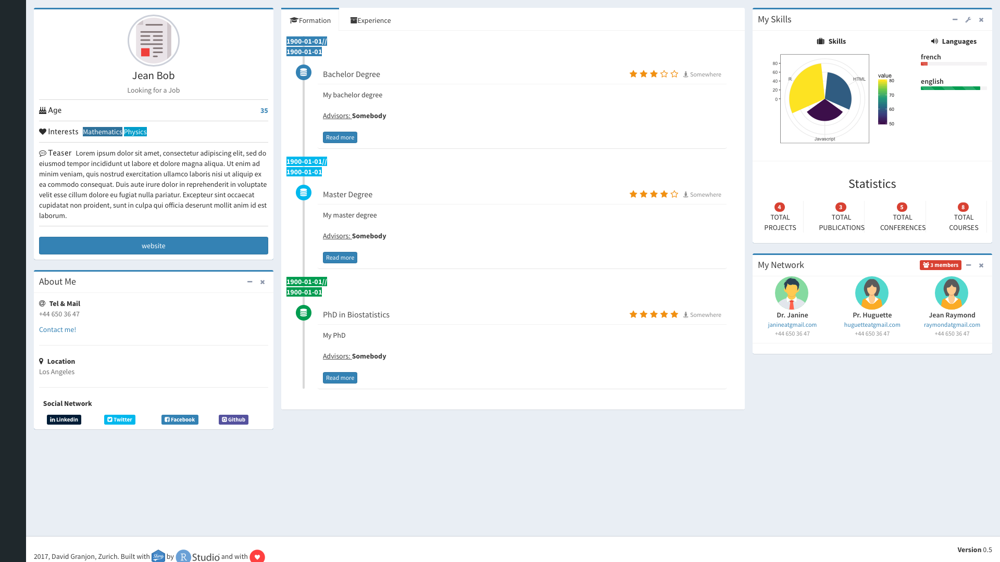
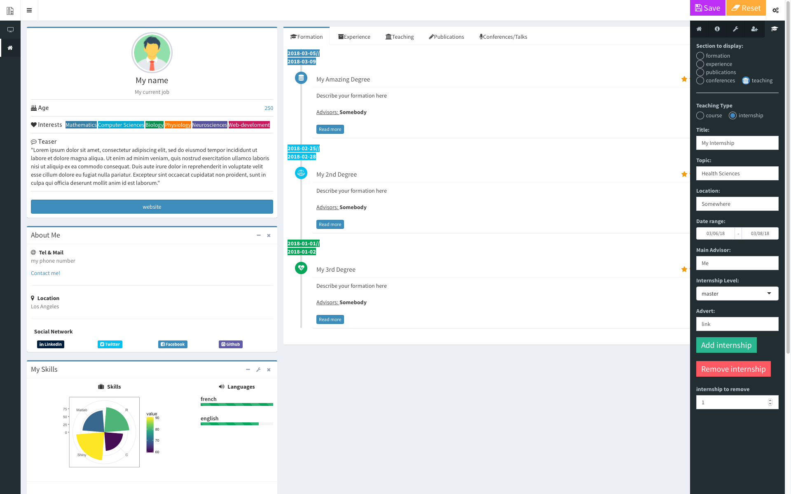
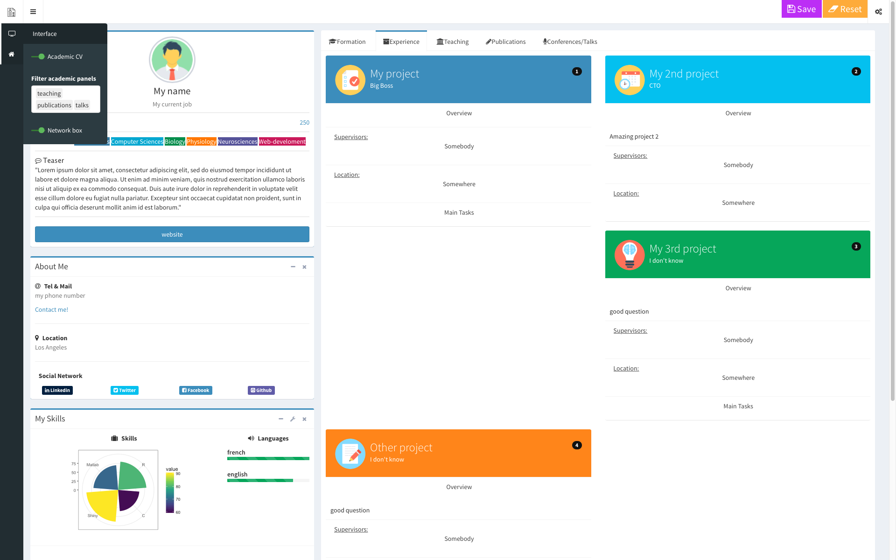
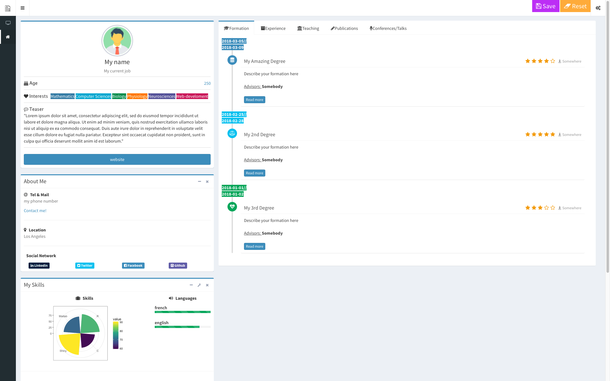
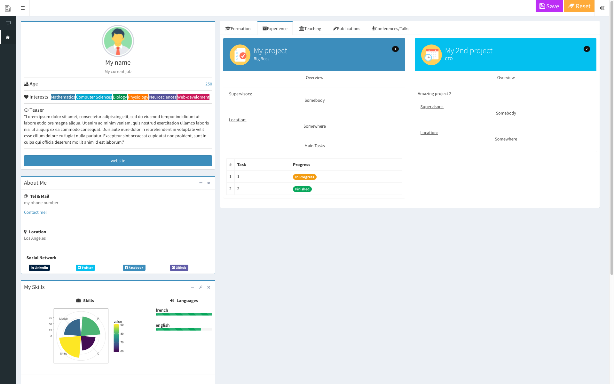
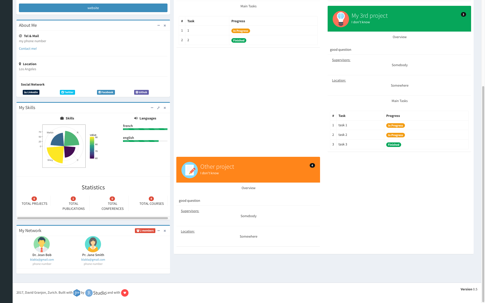
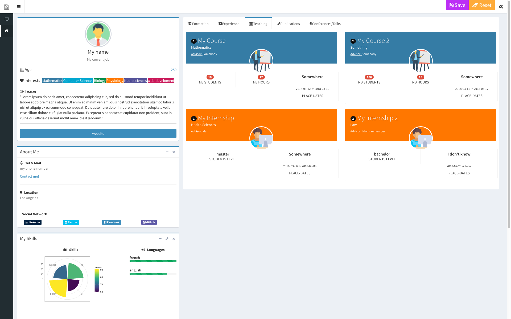

# shinyCV

> Amazing HTML CVs based upon adminLTE2 template

- https://adminlte.io/themes/AdminLTE ( main theme)
- Will be released to CRAN as soon as possible

## Package Installation

``` r
library(devtools)
install_github("DivadNojnarg/shinyCV")
library(shinyCV)
```

## Introduction: Basic Workflow

This package offers you two ways of creating nice CVs based on the AdminLTE2 template.

### With the build_shinyCV function

1. Launch the builder by using:

``` r
build_shinyCV()
```

Fill the form to build your cv step by step and save the current state at any time.
Indeed, it may take some time to fill it properly. If you reload your app, it will
be launched in the previous state.
The saved files are stored in a "data_cv.rds" as well as in the 
"Publication_img_saved" and "Profile_img_saved" folders.

2. Initialization of your main CV folder.

``` r
init_shinyCV(cv_path = your_path)
```
which will create a folder where all your CV datas and images will be stored.

3. At any time, you can preview your cv by running the dedicated function:

``` r
preview_shinyCV(cv_path, cv_mode = "basic", data_source = "from_cvbuilder", datas = NULL)
```

which will launch the previously built CV in a showcase mode. The **cv_path** argument
is where you CV is stored for instance "user/desktop/..." or whatever you choose
when you initialized your CV (step 2). The **cv_mode** argument
is a filter to only display the content which is relevant for you (see documentation). 
If you do not have any scientific publications, it makes more sens to disable them. 
The **data_source** argument is sets to "from_cvbuilder", which means that preview_shinyCV will load (if they exist)
datas generated by build_shinyCV(). It is possible to use "manual", which will allow
you to feed the CV with your own data (see next part). Finally, the datas argument is
ignored if data_source is set to "from_cvbuilder".

4. If you want to change your CV, reload `build_shinyCV()` and change what you want.
You do not need to run `init_shinyCV(cv_path = your_path)` but you should
update your CV folder with `preview_shinyCV(cv_path, cv_mode = "basic", data_source = "from_cvbuilder", datas = NULL)`

5. Once you are satisfied, you can publish your cv online to shinyapps.io.
Be careful, it will not work if you do not have a shinyapps.io account. See
[here](https://shiny.rstudio.com/articles/shinyapps.html) to configure your shinyapps.io account.
As soon as you are ready:

``` r
publish_shinyCV(cv_path)
```
where **cv_path** is again the folder where all your CV files are stored. Again,
to update your CV, just reload `publish_shinyCV(cv_path)`. You will be prompted if
you want to update your application (say yes if it is ok).
It takes around 45s-1min to push your CV to shinyapps.io!

#### Be careful
Each time this package is reinstalled for any reason (update, ...), 
the CV datas of the builder are **erased**. Therefore, if you run `build_shinyCV()`
the CV will be empty. You should not use `preview_shinyCV()` right after 
(unless you want to erase your local CV), since it will erase your local CV folder.

Instead, you have to pass the argument **import_datas** to the location
where you store your CV datas (let's say your_name/desktop/www, *never* forget the www),
the CV will be imported in the builder and you will be able to work as before.

In summary:

``` r
# you want to reinstall or update shinyCV package
library(devtools)
install_github("DivadNojnarg/shinyCV")

# set the path of your CV folder to import your old CV datas
# Do not forget the www 
path <- "blabla/blabla/www"
build_shinyCV(import_datas = path)

# you can then update your local CV folder
preview_shinyCV(cv_path, cv_mode = "basic", data_source = "from_cvbuilder", datas = NULL)

```


## A second approach: feed the viewer with your own datas!

The workflow is similar to that when you use the builder interface.

1. Initialization of your main CV folder.

``` r
init_shinyCV(cv_path = your_path)
```
which will create a folder where all your CV datas and images will be stored.

2. Preview your cv by running the dedicated function:

``` r
preview_shinyCV(cv_path, cv_mode = "basic", data_source = "manual", datas = NULL)
```
Notice that the **data_source** argument is set to manual and **datas** are NULL.
This configuration will launch the showcase mode of the manual version of shinyCV.

If you want to pass your very own datas, I created a new function called feed_shinyCV 
which allows users to provide their own datas, according to a specific structure. 
If you do not have any data, you can preview shiny CV will load a demo dataset.
Below is an example of these datas:

``` r
# datas for the profile example
  temp_profile <- list(
    my_name = "Jean Bob",
    my_position = "Looking for a Job",
    my_age = 35,
    my_interests = c("Mathematics", "Physics"),
    my_website = "http://google.com",
    my_teaser = "Lorem ipsum dolor sit amet, consectetur
    adipiscing elit, sed do eiusmod tempor
    incididunt ut labore et dolore magna aliqua.
    Ut enim ad minim veniam, quis nostrud exercitation
    ullamco laboris nisi ut aliquip ex ea commodo
    consequat. Duis aute irure dolor in reprehenderit in
    voluptate velit esse cillum dolore eu fugiat nulla pariatur.
    Excepteur sint occaecat cupidatat non proident, sunt in
    culpa qui officia deserunt mollit anim id est laborum.",
    my_image = list(
      src = system.file("App/cv_viewer/www/man.png", package = "shinyCV"),
      # very important to keep the adminLTE image border
      class = "profile-user-img img-responsive img-circle",
      alt = "User profile picture"
    )
  )

  # datas for about example
  temp_about <- data.frame(
    my_phone = "+44 650 36 47",
    my_mail = "bobatgmail.com",
    my_location = "Los Angeles",
    my_linkedin = "linkedin",
    my_twitter = "twitter",
    my_facebook = "facebook",
    my_github = "github"
  )

  # datas for skills example
  temp_skills <- data.frame(
    variable = c("R", "Javascript", "HTML"),
    value = c(80, 50, 60)
  )

  # datas for language example
  temp_languages <- data.frame(
    variable = c("french", "english"),
    value = c(10, 90)
  )

  # datas for network example
  temp_network <- data.frame(
    title = c("Dr.", "Pr.", ""),
    sex = c("male", "female", "female"),
    name = c("Janine", "Huguette", "Jean Raymond"),
    mail = c("janineatgmail.com", "huguetteatgmail.com",
             "raymondatgmail.com"),
    phone = c("+44 650 36 47", "+44 650 36 47", "+44 650 36 47")
  )

  # datas for formation example
  temp_formations <- data.frame(
    title = c("Bachelor Degree", "Master Degree", "PhD in Biostatistics"),
    topic = rep("database", 3),
    from = rep("1900-01-01", 3),
    to = rep("1900-01-01", 3),
    summary = c("My bachelor degree", "My master degree", "My PhD"),
    place = rep("Somewhere", 3),
    supervisor = rep("Somebody", 3),
    grade = c(3, 4, 5),
    extra = rep("", 3)
  )

  # datas for task example
  temp_tasks <- list(
    # one task dataframe per project
    project1 = data.frame(
      name = c("task 1", "task 2"),
      status = rep("wip", 2)
    ),
    project2 = data.frame(
      name = c("task 1", "task 2"),
      status = rep("completed", 2)
    ),
    project3 = data.frame(
      name = c("task 1", "task 2"),
      status = rep("wip", 2)
    ),
    project4 = data.frame(
      name = c("task 1", "task 2"),
      status = rep("completed", 2)
    )
  )

  # datas for project example
  temp_projects <- data.frame(
    title = c("My project 1", "My_project 2",
              "My project 3", "My project 4"),
    position = c("Big Boss", "Slave", "Big Boss", "Slave"),
    overview = rep("an amazing project", 4),
    supervisors = rep("Jean Eude", 4),
    place = rep("Somewhere", 4)
  )

  # datas for publications screenshots
  demo_list <- list(
    class = "img-responsive pad",
    src = system.file("App/cv_viewer/www/text-lines.svg", package = "shinyCV"),
    style = "height: 100px; display: block;
    margin-left: auto; margin-right: auto;"
  )
  temp_publications_screenshots <- list(demo_list, demo_list, demo_list)

 # data for publication example
  temp_publications <- data.frame(
    reference = rep("Your name et al., Journal Title, 2018", 3),
    abstract = rep("Lorem ipsum dolor sit amet, consectetur
                   adipiscing elit, sed do eiusmod tempor
                   incididunt ut labore et dolore magna aliqua.
                   Ut enim ad minim veniam, quis nostrud exercitation
                   ullamco laboris nisi ut aliquip ex ea commodo
                   consequat. Duis aute irure dolor in reprehenderit in
                   voluptate velit esse cillum dolore eu fugiat nulla pariatur.
                   Excepteur sint occaecat cupidatat non proident, sunt in
                   culpa qui officia deserunt mollit anim id est laborum.", 3),
    pubmed_link = rep("https://www.ncbi.nlm.nih.gov/pubmed", 3)
  )


  # datas for talk example
  temp_talks <- data.frame(
    title = rep("My Talk", 5),
    from = rep("1900-01-01", 5),
    to = rep("1900-01-01", 5),
    summary = rep("Lorem ipsum dolor sit amet, consectetur
                  adipiscing elit, sed do eiusmod tempor
                  incididunt ut labore et dolore magna aliqua.
                  Ut enim ad minim veniam, quis nostrud exercitation
                  ullamco laboris nisi ut aliquip ex ea commodo
                  consequat. Duis aute irure dolor in reprehenderit in
                  voluptate velit esse cillum dolore eu fugiat nulla pariatur.
                  Excepteur sint occaecat cupidatat non proident, sunt in
                  culpa qui officia deserunt mollit anim id est laborum.", 5),
    place = rep("Somewhere", 5),
    price = c(rep("yes", 3), rep("no", 2)),
    website = rep("http://google.com", 5)
  )

  # datas for course example
  temp_courses <- data.frame(
    title = rep("My course", 4),
    topic = rep("my topic", 4),
    nb_students = c(10, 100, 4, 250),
    nb_hours = c(5, 45, 8, 45),
    from = rep("1900-01-01", 4),
    to = rep("1900-01-01", 4),
    place = rep("Somewhere", 4),
    supervisor = rep("Somebody", 4),
    syllabus = rep("http://google.com", 4)
  )

  # datas for internship example
  temp_internships <- data.frame(
    title = c("My Internship 1", "My Internship 2",
              "My Internship 3", "My Internship 4"),
    topic = rep("some topic", 4),
    from = rep("1900-01-01", 4),
    to = rep("1900-01-01", 4),
    place = rep("Somewhere", 4),
    supervisor = rep("Somebody", 4),
    level = c("bachelor", "master", "PhD", "PostDoc"),
    advert = rep("http://google.com", 4)
  )
```
It is up to you to modify this structure to create your own datas.
Then, you can inject these datas in feed_shinyCV() and run view_shinyCV:

``` r
 feed_datas <- feed_shinyCV(temp_profile, temp_about, temp_skills, temp_languages, 
                            temp_network, temp_formations, temp_projects, temp_tasks, 
                            temp_publications, publications_screenshots = list(),
                            temp_talks, temp_courses, temp_internships)
                            
 preview_shinyCV(cv_path, cv_mode = "academic", data_source = "manual", datas = feed_datas)
```

Notice that this time, **datas** are not NULL.

3. If you want to change your CV, reload `feed_shinyCV()` with your new datas.
You do not need to run `init_shinyCV(cv_path = your_path)` but you should
update your CV folder with `preview_shinyCV(cv_path, cv_mode = "basic", data_source = "manual", datas = feed_datas)`

4. Once you are satisfied, you can publish your cv online to shinyapps.io.
Be careful, it will not work if you do not have a shinyapps.io account. See
[here](https://shiny.rstudio.com/articles/shinyapps.html) to configure your shinyapps.io account.
As soon as you are ready:

``` r
publish_shinyCV(cv_path)
```
where **cv_path** is again the folder where all your CV files are stored. Again,
to update your CV, just reload `publish_shinyCV(cv_path)`. You will be prompted if
you want to update your application (say yes if it is ok).
It takes around 45s-1min to push your CV to shinyapps.io!


## Examples

Below are some preview pictures of the builder mode:

 <br/>


 <br/>


 <br/>


 <br/>


 <br/>


 <br/>


 <br/>

## Upcoming features
- add an editor button to the CV builder interface (currently there are only, add and remove)
- new timeline boxes
- manually reorder panels using shinyjqui
- implement the right sidebar in R
- implement the github calendar activity: http://ionicabizau.github.io/github-calendar/example/ or http://ghchart.rshah.org/
